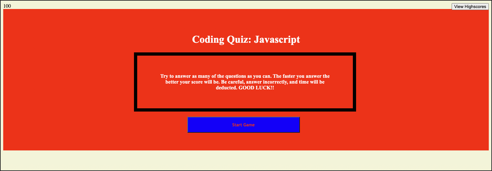

# Coding Quiz: Javascript

## Description

The motivation of this project was to develop a quiz on some basic javascript knowledge and give highscores based on a timer built into the quiz. I built this project to get better at javascript application and functionality. The problem this solves and also what I learned is that I know know how to set up parts of a quiz and build multiple screens from one document.

## Installation

I began with an HTML file that has very minimal information on it. After that I moved directly into Javascript for all of the functionality of the webpage. After getting to a point where i was satisfied with the quiz, i styled the webpage using CSS. After all of that was done and I had a final commit, I used github pages to deploy the webpage. 

## Usage

Website URL: https://carsonjames1125.github.io/coding-quiz-challenge-4/

 

## Credits

- https://stackoverflow.com/questions/31559469/how-to-create-a-simple-javascript-timer
- https://www.w3schools.com/tags/ref_byfunc.asp
- https://www.educative.io/answers/how-to-create-a-countdown-timer-using-javascript
- https://nation.marketo.com/t5/knowledgebase/how-to-move-a-form-button-left-or-right-using-css/ta-p/248907
- https://stackoverflow.com/questions/39838512/why-is-the-button-not-centered
- https://stackoverflow.com/questions/11903773/add-space-between-li-elements
- https://www.quora.com/How-do-I-move-a-button-in-CSS

## License

MIT License

Copyright (c) 2023 carsonjames1125

Permission is hereby granted, free of charge, to any person obtaining a copy
of this software and associated documentation files (the "Software"), to deal
in the Software without restriction, including without limitation the rights
to use, copy, modify, merge, publish, distribute, sublicense, and/or sell
copies of the Software, and to permit persons to whom the Software is
furnished to do so, subject to the following conditions:

The above copyright notice and this permission notice shall be included in all
copies or substantial portions of the Software.

THE SOFTWARE IS PROVIDED "AS IS", WITHOUT WARRANTY OF ANY KIND, EXPRESS OR
IMPLIED, INCLUDING BUT NOT LIMITED TO THE WARRANTIES OF MERCHANTABILITY,
FITNESS FOR A PARTICULAR PURPOSE AND NONINFRINGEMENT. IN NO EVENT SHALL THE
AUTHORS OR COPYRIGHT HOLDERS BE LIABLE FOR ANY CLAIM, DAMAGES OR OTHER
LIABILITY, WHETHER IN AN ACTION OF CONTRACT, TORT OR OTHERWISE, ARISING FROM,
OUT OF OR IN CONNECTION WITH THE SOFTWARE OR THE USE OR OTHER DEALINGS IN THE
SOFTWARE.

---

## Badges

n/a

## Features

n/a

## How to Contribute

n/a

## Tests

n/a